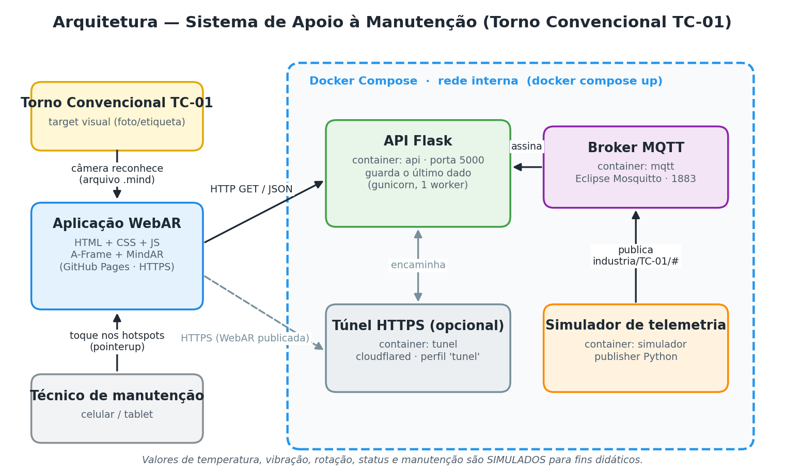

# Sistema de Apoio à Manutenção Industrial com RA e Serviços em Nuvem
### Ativo da equipe: **Torno Convencional — TC-01**

Situação de Aprendizagem Integrada — UCs **Realidade Aumentada** + **Computação em Nuvem**
Curso: Análise e Desenvolvimento de Sistemas — SENAI São Carlos

> ⚠️ **Dados didáticos.** Temperatura, vibração, rotação, status e informações de manutenção são **simulados**. Não representam limites oficiais de segurança nem parâmetros reais de nenhum torno.

---

## 1. O que o projeto faz

O técnico aponta o celular para a identificação visual do torno. A aplicação **WebAR** reconhece o equipamento e mostra **6 hotspots** que acompanham a máquina:

| # | Hotspot | Região do torno | Origem dos dados |
|---|---------|-----------------|------------------|
| 1 | Cabeçote e Placa | cabeçote fixo / placa de 3 castanhas | estático (frontend) |
| 2 | Carro e Porta-ferramenta | carro longitudinal, transversal e superior | estático (frontend) |
| 3 | Contraponto | contraponto | estático (frontend) |
| 4 | Proteção e Segurança | proteção da placa / emergência | estático (frontend) |
| 5 | Manutenção | barramento | **API Flask** `/manutencao` |
| 6 | Monitoramento | caixa de engrenagens / motor | **API Flask** `/telemetria` (vinda do MQTT) |

A identificação do ativo (nome, setor, status) aparece no topo quando o target é encontrado, também consultada na API (com texto local de reserva).

## 2. Arquitetura



```
Simulador ──publica──▶ Broker MQTT ──entrega──▶ API Flask ◀──HTTP/JSON── WebAR (celular)
                         (Mosquitto)            guarda o último valor      A-Frame + MindAR
└──────────────────── Docker Compose ────────────────────┘
```

| Serviço | Container | Porta | Função |
|---------|-----------|-------|--------|
| `mqtt` | `tc01-mqtt` | 1883 | Broker Eclipse Mosquitto: recebe e distribui telemetria |
| `api` | `tc01-api` | 5000 | Flask: assina `industria/+/+`, guarda o último dado e responde JSON |
| `simulador` | `tc01-simulador` | — | Publica dados fictícios a cada 5 s (papel do gateway da máquina) |
| `tunel` *(opcional)* | `tc01-tunel` | — | Cloudflare Quick Tunnel: dá um endereço **HTTPS** para a API |

**Dependências:** `api` e `simulador` só sobem depois que o `mqtt` passa no healthcheck (`depends_on: condition: service_healthy`).

### Tópicos MQTT
```
industria/TC-01/temperatura   -> ex.: 41.8      (°C)
industria/TC-01/vibracao      -> ex.: 2.3       (mm/s)
industria/TC-01/rpm           -> ex.: 450
industria/TC-01/status        -> operando | parado | setup
```

### Endpoints da API
| Método | Rota | Retorno |
|--------|------|---------|
| GET | `/api/saude` | estado da API e da conexão MQTT |
| GET | `/api/equipamentos/TC-01` | identificação do ativo |
| GET | `/api/equipamentos/TC-01/telemetria` | último dado recebido por MQTT |
| GET | `/api/equipamentos/TC-01/manutencao` | plano e ordens de serviço (fictícios) |

Exemplo de `/telemetria`:
```json
{
  "temperatura": 41.8, "vibracao": 2.3, "rpm": 450, "status": "operando",
  "atualizacao": "10:42:16", "idade_segundos": 1.2, "dado_antigo": false,
  "mqtt_conectado": true, "dados_didaticos": true,
  "unidades": { "temperatura": "°C", "vibracao": "mm/s", "rpm": "rpm" }
}
```

## 3. Estrutura do repositório
```
industria-ra-cloud/
├── README.md
├── compose.yaml
├── frontend/
│   ├── index.html
│   ├── css/style.css
│   ├── js/config.js          # endereço da API e id do ativo
│   ├── js/app.js             # tracking, hotspots, fetch, tratamento de falha
│   └── assets/
│       ├── images/
│       └── targets/          # torno.jpg (imagem) + torno.mind (compilado)
├── backend/                  # API Flask
│   ├── app.py
│   ├── requirements.txt
│   └── Dockerfile
├── mqtt/mosquitto.conf
├── simulator/
│   ├── simulator.py
│   ├── requirements.txt
│   └── Dockerfile            # adicionado para o simulador rodar no Compose
└── docs/
    ├── arquitetura.png
    ├── levantamento-ativo.md        # Etapas 1 e 2
    ├── testes.md                    # matriz de testes
    ├── analise-iaas-paas-saas.md    # Etapa 9
    └── perguntas-apresentacao.md    # respostas da seção 19
```

## 4. Pré-requisitos
- Docker Desktop (ou Docker Engine) com **Docker Compose v2** (`docker compose version`)
- Celular com Chrome (Android) ou Safari (iOS) com acesso à câmera
- Conta no GitHub (para publicar a WebAR no GitHub Pages)

## 5. Passo a passo

### 5.1 Gerar o target (`.mind`)
1. Tire uma foto **frontal e bem iluminada** do torno (ou de uma etiqueta/placa com bastante detalhe colada nele). Salve como `frontend/assets/targets/torno.jpg`.
2. Abra o compilador do MindAR: <https://hiukim.github.io/mind-ar-js-doc/tools/compile>
3. Envie a imagem, clique em **Start**, baixe o arquivo e salve como `frontend/assets/targets/torno.mind`.
4. Imprima a mesma imagem (ou use a própria máquina) como target físico.

> Imagens com muitos detalhes e contraste rendem mais pontos de rastreamento. Superfícies lisas e reflexivas rastreiam mal.

### 5.2 Subir os serviços
```bash
docker compose up -d --build
docker compose ps                # api, mqtt e simulador devem aparecer "running/healthy"
docker compose logs -f simulador # acompanha a publicação dos dados
```
Teste no navegador do computador: <http://localhost:5000/api/equipamentos/TC-01/telemetria>

### 5.3 Publicar a WebAR (GitHub Pages)
1. Envie o repositório para o GitHub.
2. *Settings → Pages → Deploy from a branch* → branch `main`, pasta `/ (root)`.
3. A WebAR ficará em `https://SEU-USUARIO.github.io/industria-ra-cloud/frontend/`.

### 5.4 Ligar a WebAR (HTTPS) à API
O GitHub Pages é **HTTPS** e o navegador **bloqueia** chamadas para uma API em **HTTP** (conteúdo misto). Por isso a API também precisa de HTTPS:

```bash
docker compose --profile tunel up -d
docker compose logs tunel | grep trycloudflare
# copie o endereço: https://algumas-palavras.trycloudflare.com
```
Abra no celular, uma única vez:
```
https://SEU-USUARIO.github.io/industria-ra-cloud/frontend/?api=https://algumas-palavras.trycloudflare.com
```
O endereço fica salvo no aparelho. Para trocar, abra de novo com outro `?api=`. (O endereço do túnel muda toda vez que o container `tunel` é recriado.)

**Alternativa só na rede local:** com o celular e o PC no mesmo Wi-Fi, a API responde em `http://IP-DO-PC:5000`, mas a câmera só funciona em HTTPS ou `localhost` — por isso o túnel é o caminho recomendado para a demonstração.

### 5.5 Ajustar a posição dos hotspots
Abra a WebAR com `&debug=1` no final da URL: cada hotspot mostra suas coordenadas. Edite `posicao` em `frontend/js/app.js` (lista `HOTSPOTS`):
- `x` vai de **-0.5** (borda esquerda da foto) a **+0.5** (borda direita);
- `y` vai de **-altura/2** a **+altura/2**, em que altura = altura ÷ largura da foto (foto 2:1 → -0.25 a +0.25).

## 6. Roteiro da demonstração (comandos)

| Passo | O que fazer |
|-------|-------------|
| 2–4 | Apontar para o target → estado **RA ATIVA** → tocar hotspots 1 a 4 |
| 5 | Tocar **Monitoramento** → dados vindos da API |
| 6 | Publicar valor manual (pare o simulador antes, para ele não sobrescrever): |

```bash
docker compose stop simulador
docker compose exec mqtt mosquitto_pub -h localhost -t industria/TC-01/temperatura -m 47.2 -r
docker compose exec mqtt mosquitto_pub -h localhost -t industria/TC-01/status -m parado -r
```
| Passo | O que fazer |
|-------|-------------|
| 7 | O painel aberto atualiza sozinho (5 s) → mostra **47.2 °C** com destaque |
| 8 | `docker compose stop api` → painel mostra a mensagem de indisponibilidade; hotspots estáticos continuam funcionando |
| 9 | `docker compose start api` → **Tentar novamente** → volta a funcionar |
| 10 | `docker compose start simulador` e explicar a arquitetura (`docker compose ps`) |

## 7. Executar sem Docker (opcional, para desenvolvimento)
```bash
# terminal 1 — broker (precisa do Mosquitto instalado)
mosquitto -c mqtt/mosquitto.conf
# terminal 2 — API
cd backend && pip install -r requirements.txt && python app.py
# terminal 3 — simulador
cd simulator && pip install -r requirements.txt && python simulator.py
```

## 8. Solução de problemas
| Sintoma | Causa provável / solução |
|---------|---------------------------|
| Tela preta / "não foi possível iniciar a câmera" | Página não está em HTTPS, permissão de câmera negada ou `torno.mind` ausente |
| Monitoramento sempre "indisponível" no celular | `?api=` não informado, túnel desligado ou endereço do túnel mudou |
| Temperatura volta sozinha após `mosquitto_pub` | O simulador continua publicando — use `docker compose stop simulador` |
| `mqtt_conectado: false` | Broker parado; a API mostra o último valor conhecido e reconecta sozinha |
| Hotspots fora do lugar | Ajustar `posicao` em `app.js` (seção 5.5) |

## 9. Segurança (escopo didático)
O broker aceita conexões anônimas e a API está com CORS liberado para facilitar o protótipo. Em produção: autenticação no Mosquitto (`password_file`), TLS (porta 8883), CORS restrito ao domínio da WebAR e API atrás de um proxy HTTPS.

## 10. Equipe
| Nome | Responsabilidade |
|------|------------------|
| Vitor Dias | |
| | |
| | |
| | |
